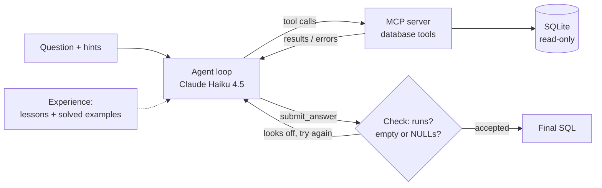

# sql-agent-bird

An AI agent that answers questions about databases it has never seen, by writing and testing
SQL. I built it to answer one question: **does an AI get better at a new database the way a new
hire does, by looking around first and then by learning from experience?**

Built in Python on the Claude API. The agent loop is written by hand, with no agent framework.
The database tools run as an MCP server.

## The idea

When a good analyst joins a new company, they don't know the databases yet. On day one they
make mistakes. After a few weeks they know the odd columns and the house rules, and they
remember what tripped them up before.

So I compared three versions of the same model:

- **One-shot:** reads the table list and writes one SQL query. No looking at the data.
- **Agent:** can look at the data and test its queries before answering.
- **Experienced agent:** the agent, plus notes from training: lessons from its own past
  mistakes and solved examples on the same databases.

## Results

150 test questions from [BIRD](https://bird-bench.github.io/), a public text-to-SQL benchmark.
Claude Haiku 4.5 for all three. A query counts as right if it returns the same rows as the
official answer.

| | One-shot | Agent | Experienced agent |
|---|---|---|---|
| Right answers | 75% | 79% | **85%** |
| Time per question | 1 s | 9 s | 9 s |

- Looking at the data helped: 75% to 79%. But that gap is small enough that it could be luck.
- Experience helped more: 85%. Against one-shot, this is the only gap big enough to be sure it
  isn't luck. Against the plain agent, it's likely but not certain.
- Both agents take about 7x longer than one-shot.

I built and tuned everything on a separate set of 100 training questions. The test set was only
used for the final numbers.

### Fixing the answer key first

While checking the agent's mistakes, I kept finding that the agent was right and BIRD's
official answer was wrong. So I checked every question:

- A stronger model (Claude Opus 5.5) solved each question on its own, without seeing the
  official answer.
- Where the two answers differed, a separate session compared them without knowing which one was
  official, and picked the right one with proof.

About 1 in 4 questions had a wrong or unclear official answer. For example, one question asks
for the average number of oxygen atoms per molecule. The official answer says 117. No molecule
has more than 16.

I swapped each bad question for a random BIRD question of the same difficulty that passed the
same check. The final question lists are in [`data/splits/`](data/splits), so anyone can rerun
the results with the public BIRD data.

### What didn't help

- **A self-check step** (rerun and question the answer if it comes back empty or with NULLs):
  no change.
- **Extra tools for peeking at column values:** no change. The agent just used plain queries
  instead.

### Where the agent still goes wrong

Most of its own mistakes are about what to return, not how to find it: an extra column nobody
asked for, or a missing ID the question implied.

### Limits

- 150 questions is a small test. Only the experienced agent's lead is clearly real.
- The experienced agent gets two things at once: lessons from its mistakes and solved examples.
  I can't tell which one did the work. When I looked at the lessons, the model named its real
  mistake only about half the time, so the examples may matter more.
- Its lessons and examples come only from the training questions. It never sees a test question.
  But the training and test questions use the same databases, so it already knows those
  databases a little. That's the point of the experiment, but it means these numbers can't be
  compared with the BIRD leaderboard, where every database is new.
- The cleaned set is easier than full BIRD, because many vague hard questions were removed.
- The answer-key check was done by an AI. It can miss a mistake if it makes the same one.
- One model only.

On the original 150 questions, before the fix, the scores were 61%, 65% and 65%.

## How it works



### The agent loop

I wrote the loop myself on the Claude Messages API instead of using a framework, so every step
is visible and easy to change.

- **The model sees** the instructions, the full schema with column descriptions, and the
  question with BIRD's hints.
- **Each turn** the model calls one or more tools. The tools run in parallel, and all the
  results go back together in one message. Failed tools are marked as errors so the model
  knows to fix its query.
- **I keep the conversation history myself:** every model reply and every tool result is added
  to the message list and sent back on the next turn.
- **Prompt caching:** the instructions and schema are cached once per database. The newest
  message also carries a cache marker, so each turn only pays for what's new.
- **Turn limit:** at most 8 turns. Before the last one the agent gets a "last turn, submit now"
  warning. If it never submits, its last query that ran is used.
- **Retry if no tool call:** if the model answers in plain text instead of calling a tool, it
  gets one reminder to submit.

### Tools

**Database tools (MCP server).** Each database gets its own server, built with the official
MCP Python SDK. The agent connects to it as an MCP client and turns the tool list into Claude's
tool format.

| Tool | What it does |
|---|---|
| `list_tables` | Lists the tables |
| `describe_table` | Columns, keys and what each column means |
| `search_schema` | Finds columns by keyword, e.g. "free meal" |
| `sample_values` | A few real values from a column |
| `distinct_values` | Distinct values, optionally filtered |
| `run_query` | Runs SQL and shows the first rows |

**`submit_answer` (my own tool, not MCP).** This is how the agent ends: it submits one query
through a tool with a strict input format, so the answer is never buried in free text. Before
accepting, the loop runs the query itself. If it fails, the agent must fix it. If it comes back
empty or with NULLs, the agent is asked once to double-check.

**Safety.** The model writes the SQL, so the database side doesn't trust it:

- Databases open read-only, and anything that isn't a read is blocked.
- Queries time out after 15 seconds.
- Results are cut to the first rows so they don't flood the model.
- Errors come back as clear messages the model can act on, not a generic failure.

### The experienced agent

Same agent, with an extra block in the prompt:

- **Lessons:** after a training run, the model looked at each of its real mistakes next to the
  right answer and wrote a one-line lesson.
- **Its past mistakes on this database:** its wrong SQL next to the right SQL.
- **Solved examples on this database** from the training questions.

A question never sees its own entry.

### Testing and logging

- **Scoring** follows BIRD's official rule: same set of rows, row order ignored. The scorer is
  tested against the official logic.
- **Every model call and tool call** is logged to a JSONL file with tokens and timing.
- **API responses are cached on disk,** so rerunning the same command gives the same result.
- **Temperature 0** for all runs.

### Why no agent framework

I wanted to control and understand every step: the history, the caching, how tool errors are
handled. The Claude Agent SDK would have been the natural choice otherwise.

## Project layout

```
src/sqlagent/
  systems/       oneshot.py, single_agent.py, experienced_agent.py
  mcp_server/    the MCP database server
  tools.py       database tools used by the server
  db.py          read-only SQLite access with timeouts
  llm.py         Claude API wrapper: disk cache and logging
  experience.py  builds the lessons file
  eval/          scorer (ex.py) and runner (run.py)
data/splits/     question lists (training and test, original and cleaned)
data/experience/ lessons and past mistakes used by the experienced agent
tests/
```

## How to run

```bash
uv sync
cp .env.example .env                    # add your Anthropic API key
uv run python scripts/download_bird.py  # download BIRD dev data (not committed)
uv run pytest -q

# Run a system on the test set (--final is required to touch test)
uv run python -m sqlagent.eval.run --system oneshot --split test_clean --final
uv run python -m sqlagent.eval.run --system single_agent --split test_clean --final
uv run python -m sqlagent.eval.run --system experienced_agent --split test_clean --final
```

Results go to `runs/<run_id>/`: one line per question (`predictions.jsonl`), a summary and the
log. Rerunning the same command picks up where it stopped.

## Data and license

Code: MIT. BIRD data: CC BY-SA 4.0, © the BIRD authors. It is downloaded by
`scripts/download_bird.py` and never committed.
